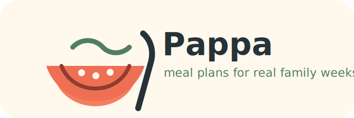

# Pappa

Pappa is a small family meal-planning app for turning real-life constraints into practical meal plans and grocery lists.

Current direction:

- simple shared meal plans
- grocery lists that work on a phone
- baby/family-friendly notes without overcomplicating dinner
- future support for favourites, multiuser planning, and shared checklist state

This repo is intentionally small while the first version takes shape.
